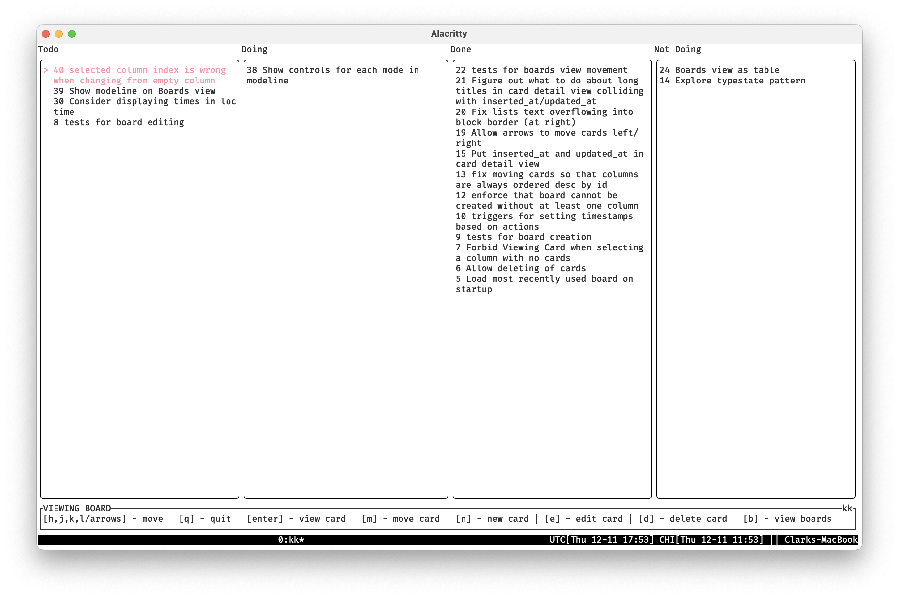
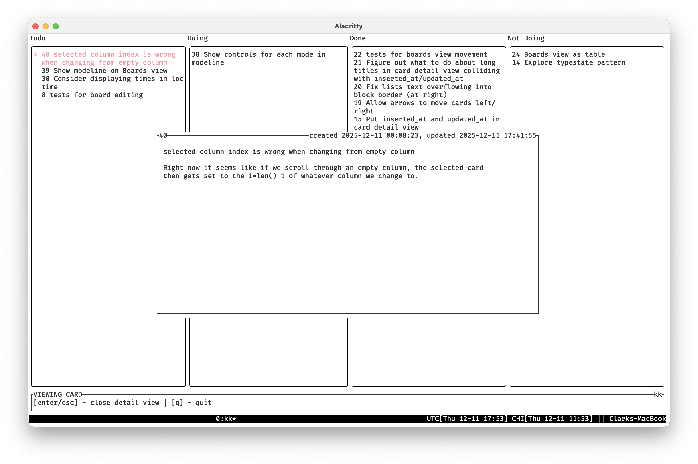
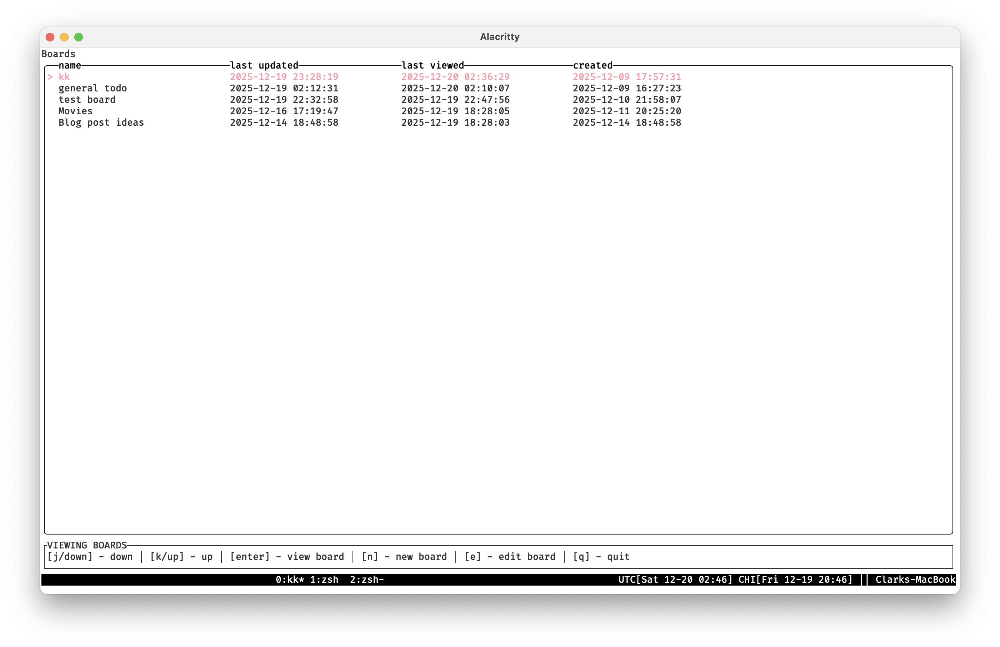
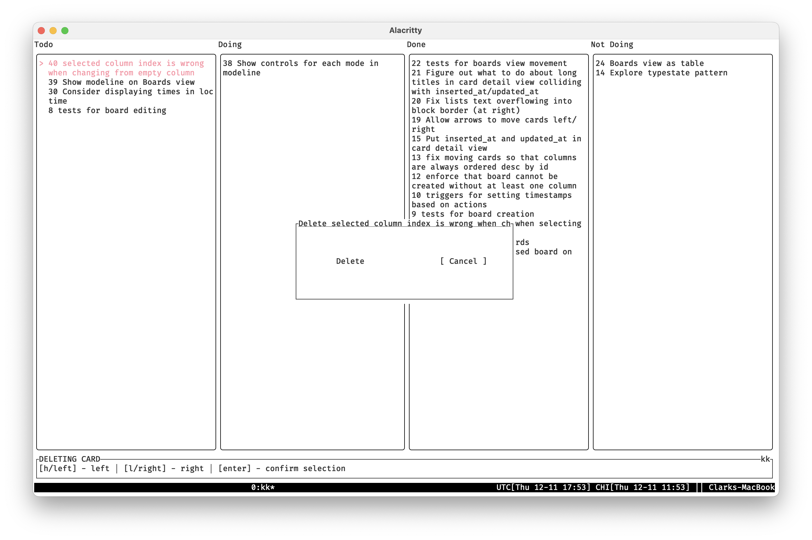

# kk

Vim-like Kanban TUI. Keep 'em moving!

[](https://github.com/ckampfe/kk/actions/workflows/rust.yml)

===

# Screenshots

### View and navigate a board



### View a card



### View and switch between boards



### Delete a card



# Use

The controls in the modeline (at bottom) tell you what operations are possible in a given mode.

`kk` itself is almost entirely about spatial navigation, not text editing.

Anything that involves editing (creating a card or board, editing a card or board) will open up your configured `$EDITOR` with either a template or the current state of your card/board.

`kk` then reads in the result of that editing, parses it, and updates the given card or board.

# Install

1. [Install Rust](https://rust-lang.org/learn/get-started/)
2. `cargo install russ --git https://github.com/ckampfe/kk`


# Functionality

You can:

- view a board
- create a card
- view that card's detail
- move that card between columns
- delete a card
- create a board
- switch between boards
- add a new column to a board

# Help

```
$ kk -h
Usage: kk [OPTIONS]

Options:
  -d, --database-path <DATABASE_PATH>  [env: DATABASE_PATH=]
  -h, --help                           Print help
  -V, --version                        Print version
```

# Design

[Rust](https://rust-lang.org/), [Ratatui](https://ratatui.rs/), [SQLite](https://sqlite.org/), whatever text editor you like.

# Performance

On my system, it uses about 5MB of memory at idle.